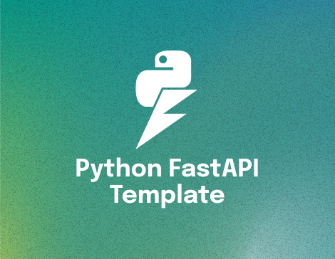

<div>
  <a href="https://www.wednesday.is?utm_source=gthb&utm_medium=repo&utm_campaign=serverless" align="left" style="margin-left: 0;">
    
  </a>
  <p>
    <h1 align="left">Python FastAPI Template
    </h1>
  </p>

  <p>
An enterprise Python FastAPI template application to create and deploy FastAPI project.
  </p>

  ___


  <p>
    <h4>
      Expert teams of digital product strategists, developers, and designers.
    </h4>
  </p>

  <div>
    <a href="https://www.wednesday.is/contact-us?utm_source=gthb&utm_medium=repo&utm_campaign=serverless" target="_blank">
      
    </a>
    <a href="https://github.com/wednesday-solutions/" target="_blank">
      
    </a>
  </div>

  ___

  <span>We’re always looking for people who value their work, so come and join us. <a href="https://www.wednesday.is/hiring">We are hiring!</a></span>
</div>


This repository provides a template for creating and deploying a FastAPI project. Follow the steps below to set up the local environment, run the project, manage database migrations, and deploy the service on AWS ECS.

## Table of Contents

- [Features](#features)
- [Getting started](#getting-started)
   - [Initialize & Setup Environment](#1-initialize--setup-environment)
   - [Variables Configuration](#2-variables-configuration)
   - [Database Migrations](#3-database-migrations)
   - [Redis Dependency & Installation](#4-redis-dependency)
   - [Celery Dependency](#5-celery-dependency)
   - [Run the Project](#6-run-the-project)
- [Advanced Usage](#advanced-usage)
   - [Circuit breakers](#circuit-breakers)
   - [Configuring Signoz Monitoring Tool](#configuring-signoz-monitoring-tool)
   - [Logging with Signoz](#logging-with-signoz)
   - [Database Monitoring Using Percona](#database-monitoring-using-percona)
   - [Deploy Service on AWS ECS](#deploy-service-on-aws-ecs)
   - [Related Dashboard Links](#related-dashboard-links)
   - [Additional Useful scripts](#additional-useful-scripts)

### Features

- Python 3.11+ support
- SQLAlchemy 2.0+ support
- Asynchronous capabilities
- Database migrations using Alembic
- Basic Authentication using JWT
- Caching using Redis
- Dockerized application
- Asynchronous background tasks using Celery
- Feature flagging to enable/disable features
- Readily available CRUD operations
- Readily available middlewares for rate limiting, request id injection etc
- Error reporting using Sentry
- Type checking using mypy
- Linting using flake8
- Formatting using black
- Code quality analysis using SonarQube
- Application monitoring using SigNoz
- Database Monitoring using Percona
- Load-tests using Locust

### Getting Started

#### Requirements:
- Python 3
- Docker
- mysql

#### 1. Initialize & Setup Environment

- To initialize and set up your environment, run the following script:

```shell
./scripts/initialize-env.sh
```

This script installs the necessary dependencies and prepares the environment for running the FastAPI application on your machine.

##### Activate the environment

- To activate the python environment, run the following command:
```
# Mac & Linux:
source ./venv/bin/activate

# Windows
.\venv\scripts\activate
```

#### 2. Variables Configuration
Update database environment variables in your .env.local file:
```
DB_NAME=
DB_HOSTNAME=localhost
DB_PORT=3306
DB_USERNAME=
DB_PASSWORD=
```
Additional Configuration (Optional):
```
SENTRY_DSN=
SLACK_WEBHOOK_URL=
DB_ROOT_PASSWORD=
```

#### 3. Database Migrations
Create new database migrations when you make changes to your models. Use the following command:
```shell
alembic revision -m 'brief description of changes'
```

This command initializes a new migration script based on the changes made to your models. Provide a brief description of the changes in the migration message.

Apply the database migrations with the following command:
```shell
alembic upgrade head
```
This command updates the database schema to reflect the latest changes defined in the migration scripts

#### 4. Redis Dependency

To install and set-up Redis execute the following commands: 

##### Install Locally:


- ###### Mac
    ```shell
    brew install redis
    brew services start redis
    ```

- ###### Windows
    ```
    Please refer: https://developer.redis.com/create/windows/
    ```
- ###### Linux
    ```shell
    sudo apt install redis
    sudo systemctl enable redis
    sudo systemctl start redis
    sudo systemctl status redis  # verify status
    
    ```

##### Install via docker:
```shell
docker run --name recorder-redis -p 6379:6379 -d redis:alpine
```

#### 5. Celery Dependency
To initialize the celery worker execute the following command:
```shell
celery -A app.app.celery worker -l info
```
[Optional] To activate Celery Flower execute the following command:
```shell
flower --broker=${REDIS_URL}/6 --port=5555
```

#### 6. Run the Project

##### Running Application Locally

```shell
./scripts/local_server.sh
```

This script upgrades the database migrations using Alembic and starts the FastAPI server using Uvicorn. The server is hosted on 0.0.0.0 and port 8000, making it accessible locally.

##### Running Application into Docker Container

- Create a file .env.docker with reference of .env.example
- Inject Docker environment using
  ```shell
  set -a source .env.docker set +a
- Execute following command to turn on the application
  ```shell
  docker compose --env-file .env.docker up
  ```

### Advanced Usage

#### Circuit breakers

Using the Circuit Breaker for External API Calls

Our application uses a circuit breaker pattern to enhance its resilience against failures in external services. The circuit breaker prevents the application from performing operations that are likely to fail, allowing it to continue operating with degraded functionality instead of complete failure.

How to Use?
- For any external service call, wrap the call with the circuit breaker.
- The circuit breaker is configured to trip after a certain number of consecutive failures. Once tripped, it will prevent further calls to the external service for a defined period.

Example

Here's an example of using the circuit breaker in an API route:

```
@app.get("/external-service")
async def external_service_endpoint():
    try:
        with circuit_breaker:
            result = await external_service_call()
            return {"message": result}
    except CircuitBreakerError:
        raise HTTPException(status_code=503, detail="Service temporarily unavailable")
```

#### Configuring SigNoz Monitoring Tool

To utilize SigNoz for monitoring your applications, follow these steps:

1. **Sign Up:**
   - Go to the SigNoz cloud portal [here](https://signoz.io/teams/).
   - Sign up for an account.
   - After signing up, you will receive a verification email from SigNoz.

2. **Verify Email:**
   - Verify your email through the verification email sent by SigNoz.

3. **Application Monitoring Setup:**
   - Once verified, log in to your SigNoz account.
   - Click on "Application Monitoring".

4. **Configure Application:**
   - Select Python as the language.
   - Provide a service name.
   - Choose FastAPI as the framework.

5. **Setup Quickstart:**
   - Select your OS and architecture.
   - Choose Quickstart.
   
6. **Install Dependencies:**
   - Skip this step and move to next step.

7. **Configure Environment Variables:**
   - In the next step, you need to update the values for the following variables in `.env.local` and `.env.docker` files:
     ```
     OTEL_RESOURCE_ATTRIBUTES=
     OTEL_EXPORTER_OTLP_ENDPOINT=
     OTEL_EXPORTER_OTLP_HEADERS=
     OTEL_EXPORTER_OTLP_PROTOCOL=
     ```

#### Logging with SigNoz

To enable logging with SigNoz, follow these steps:

1. **Open Dashboard:**
   - Log in to your SigNoz dashboard.

2. **Navigate to Logs Section:**
   - Go to the logs section of your dashboard.

3. **Configure Log Sending:**
   - Click on "Sending Logs to SigNoz".

4. **Follow Instructions:**
   - Follow the instructions provided to configure log sending to SigNoz.

By following these steps, you can effectively set up application monitoring and logging using SigNoz for your Python FastAPI applications.

#### Database Monitoring Using Percona

To monitor your database using Percona, follow these steps:

1. **Run Application Inside Docker Container:**
   - Ensure that your application is running inside a Docker container.

2. **Open Dashboard:**
   - Open your web browser and navigate to `https://localhost:443`.

3. **Login:**
   - Use the following credentials to log in:
     ```
     Username: admin
     Password: admin
     ```

4. **Access Settings:**
   - Once logged in, navigate to the settings section of the dashboard.

5. **Add Service:**
   - Within the settings, locate the "Add Service" option.

6. **Select MySQL:**
   - Choose MySQL as the service you want to monitor.

7. **Provide Database Details:**
   - Enter the hostname, username, password, and any other necessary environment variables required to connect to your MySQL database.

8. **Finish Configuration:**
   - Click add service.

By following these steps, you'll successfully configure Percona to monitor your MySQL database.

#### Deploy Service on AWS ECS
To deploy the FastAPI application on AWS ECS, use the following script:

```shell
./scripts/setup-ecs.sh develop
```

The setup-ecs.sh script leverages AWS Copilot to deploy the service. Provide the environment name as an argument (e.g., develop). The script creates and deploys an environment, then deploys the FastAPI service on that environment.

Note: Ensure you have AWS credentials configured and AWS Copilot installed for successful deployment.

#### New to AWS Copilot?
If you are new to AWS Copilot or you want to learn more about AWS Copilot, please refer to [this helpful article](https://www.wednesday.is/writing-tutorials/how-to-use-copilot-to-deploy-projects-on-ecs) that guides you through the process of setting up AWS Copilot locally as well as also helps you understand how you can publish and update an application using 4 simple steps.


#### Related Dashboard Links
- Percona: https://localhost:443
- Flower: http://localhost:5556
- Locust UI: http://localhost:8089
- Swagger UI: http://localhost:8000


#### Additional Useful scripts
- Tests - scripts/run_tests.sh
- Linting & Formatting - scripts/lint_and_format.sh
- Load tests - scripts/load_tests.sh (Change [locust.conf](https://docs.locust.io/en/stable/configuration.html) accordinly)
